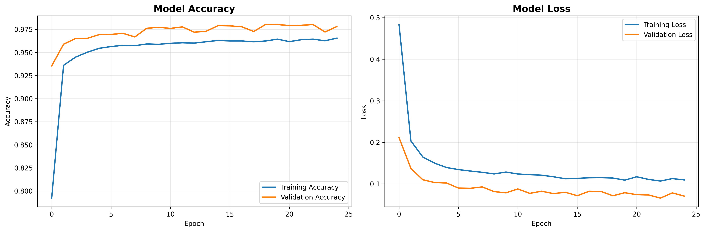
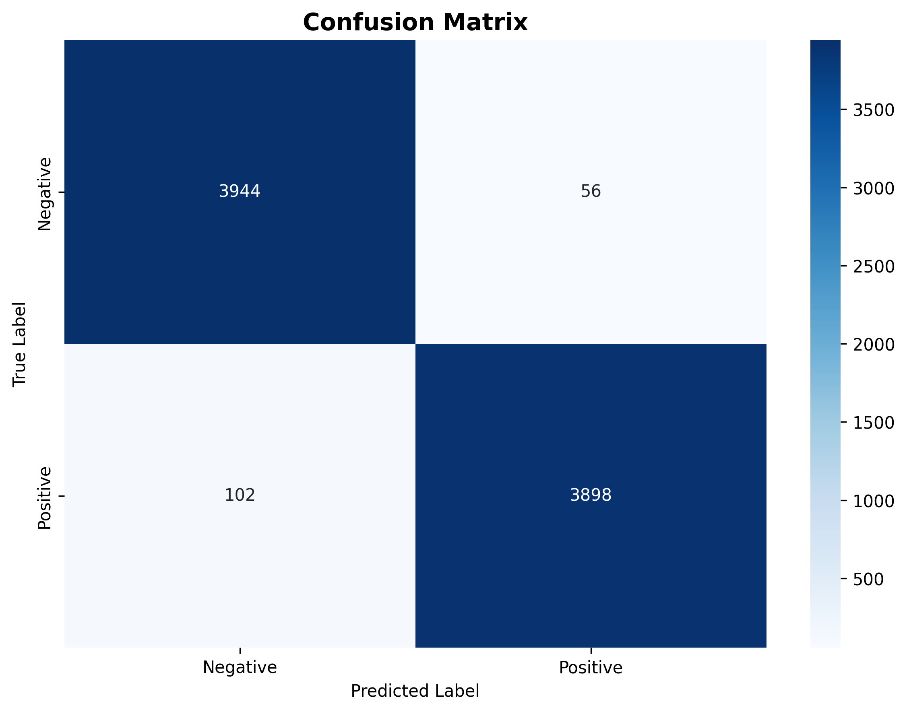

# Concrete Crack Detection using ResNet101 Transfer Learning

A deep learning project for binary classification of concrete crack images using transfer learning with ResNet101 pre-trained on ImageNet. The model classifies images as either containing cracks (Positive) or being crack-free (Negative).

## Project Overview

This project implements an automated concrete crack detection system that can assist in infrastructure maintenance and safety inspections. Using computer vision and deep learning, the model can accurately identify concrete cracks from images, potentially reducing manual inspection time and improving detection consistency.

## Dataset

**Source**: Özgenel, Çağlar Fırat (2019), "Concrete Crack Images for Classification", Mendeley Data, V2  
**DOI**: [10.17632/5y9wdsg2zt.2](https://data.mendeley.com/datasets/5y9wdsg2zt/2)

### Dataset Statistics
- **Total Images**: 40,000
- **Positive Samples** (with cracks): 20,000
- **Negative Samples** (without cracks): 20,000
- **Training Set**: 32,000 images (80%)
- **Validation Set**: 8,000 images (20%)
- **Image Resolution**: 227×227 pixels
- **Format**: RGB images

The dataset is perfectly balanced with equal numbers of positive and negative samples, eliminating class imbalance issues.

## Model Architecture

### Base Model
- **Architecture**: ResNet101 pre-trained on ImageNet
- **Transfer Learning**: Frozen base layers + custom classification head
- **Input Shape**: 227×227×3 (RGB images)

### Custom Classification Head
```
GlobalAveragePooling2D()
├── Dense(256, activation='relu')
├── Dropout(0.5)
├── Dense(128, activation='relu')
├── Dropout(0.3)
└── Dense(2, activation='softmax') 
```

## Results

### Final Performance Metrics
- **Validation Accuracy**: **98.03%**
- **Validation Loss**: 0.0660
- **Training Accuracy**: 96.56%
- **Training Loss**: 0.1097

### Classification Report
```
              precision    recall  f1-score   support

    Negative       0.97      0.99      0.98      4000
    Positive       0.99      0.97      0.98      4000

    accuracy                           0.98      8000
   macro avg       0.98      0.98      0.98      8000
weighted avg       0.98      0.98      0.98      8000
```

### Key Achievements
- **High Accuracy**: 98.03% validation accuracy
- **Balanced Performance**: Similar precision and recall for both classes
- **No Overfitting**: Small gap between training and validation metrics
- **Robust Classification**: F1-score of 0.98 for both crack detection and normal concrete

## Visualizations

### Training History



### Confusion Matrix



## Usage

### Prerequisites
```bash
pip install tensorflow numpy matplotlib seaborn scikit-learn
```

### Running the Project
1. Download the dataset from the Mendeley repository
2. Organize data in `data/Concrete Cracks/` with `Positive/` and `Negative/` subfolders
3. Run the Jupyter notebook `ResNet_Concrete_Crack_Detection.ipynb`

## Real-World Applications

- **Infrastructure Monitoring**: Automated crack detection in bridges, buildings, and roads
- **Quality Control**: Construction industry quality assurance
- **Maintenance Planning**: Prioritizing repair schedules based on crack severity
- **Safety Inspections**: Reducing human error in structural assessments

## License

This project uses the publicly available concrete crack dataset. Please cite the original dataset when using this work.

---

*For detailed implementation and code, refer to the Jupyter notebook `ResNet_Concrete_Crack_Detection.ipynb`*
